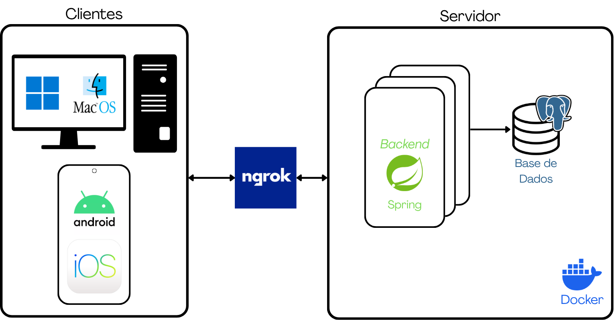

# Insurance Reporter App

> Projeto Final de Curso — ISEL 2025/26

---

## Enquadramento

Nos últimos anos, tem-se verificado um aumento da necessidade de averiguação de sinistros, nomeadamente sinistros laborais, rodoviários e resultantes de catástrofes naturais. As seguradoras enfrentam a necessidade de enviar averiguadores ao local da ocorrência no processo de averiguação de um sinistro, sendo necessário recolher um conjunto diversificado de elementos, incluindo fotografias, descrições técnicas, medições e declarações dos intervenientes. Com o aumento da complexidade das ocorrências e da exigência de decisões rigorosas, a utilização de métodos tradicionais, como bloco de notas ou gravador de voz, mesmo com o apoio de um _smartphone_, poderá não ser a solução mais adequada, dado estar sujeita a erros, perdas de informação e dificuldades na organização dos dados.

---

## Soluções Existentes e Estado Atual do Processo

Atualmente, o processo de averiguação no terreno assenta num conjunto de métodos e ferramentas genéricas. É comum os averiguadores recorrerem a meios tradicionais, como o bloco de notas, o gravador de voz e a câmara fotográfica do _smartphone_, complementados por aplicações genéricas como folhas de cálculo e de notas. A consolidação de todos estes elementos num relatório final é, normalmente, realizada pelo próprio averiguador de forma não automática.

No mercado segurador existem diversas soluções destinadas à gestão e tratamento de sinistros, disponibilizando funcionalidades como a participação digital de ocorrências, gestão documental, recolha de evidências e automatização de processos. No entanto, muitas destas soluções encontram-se focadas apenas em etapas específicas do processo de sinistro ou apresentam uma elevada complexidade de utilização, estando orientadas para a gestão operacional das seguradoras em vez do apoio direto ao averiguador. A _Insurance Reporter App_ pretende responder a esta necessidade por uma solução integrada que apoia o averiguador em todas as fases do processo de averiguação.

A solução desenvolvida procura distinguir-se destas alternativas em vários aspetos:
- Funcionamento _offline_ — A recolha de dados no terreno não depende de conectividade, sendo a informação sincronizada automaticamente assim que a ligação é restabelecida;
- Formulários dinâmicos e configuráveis — A estrutura dos formulários é definida por configuração, adaptando-se a diferentes tipos de sinistro;
- Ecossistema multiplataforma — A vertente móvel, direcionada para o trabalho no terreno, e a vertente _desktop_, direcionada para a gestão e revisão;
- Centralização e geração de relatórios — A informação é centralizada num _backend_ próprio, com vista à geração padronizada do relatório de averiguação em formato _PDF_.

Em síntese, enquanto as ferramentas genéricas e as plataformas comerciais existentes cobrem partes do processo, a solução proposta diferencia-se por integrar, de forma dedicada, a recolha no terreno, a resiliência _offline_ e a adaptabilidade dos formulários num único ecossistema orientado ao trabalho do averiguador.

---

## Objetivos

O projeto _Insurance Reporter App_ visa a modernização, automatização e simplificação deste processo, através de uma aplicação móvel, complementada por uma aplicação _desktop_. Estas aplicações, móvel e _desktop_, têm como principal objetivo apoiar o averiguador na recolha dos diversos elementos necessários, através de um documento padrão, designado relatório de averiguação. Simultaneamente, pretende-se facilitar a análise por parte da seguradora ou entidade responsável, de forma a permitir uma decisão documentada e célere.

Para a realização do projeto foram definidos os seguintes requisitos:

- O sistema deve permitir criar relatórios de averiguação para os diferentes tipos de sinistros;
- Os dados devem ser centralizados numa base de dados, de forma a garantir a sua integridade;
- As aplicações, _desktop_ e móvel, devem:
  - Permitir o registo de fotografias, vídeos e medições relacionadas com o sinistro;
  - Ser operacionais mesmo sem conectividade, garantindo o armazenamento seguro dos dados;
  - Permitir aos averiguadores autorizados editar, submeter e gerar o relatório de averiguação;
  - Permitir a exportação dos relatórios em formato PDF, bem como da documentação anexa;
  - Permitir a sincronização automática quando a conectividade estiver disponível, sincronizando os diversos elementos recolhidos com o servidor.

---

## Solução Proposta

A arquitetura proposta estrutura-se num ecossistema multiplataforma, constituído por aplicações cliente direcionadas para ambientes móveis e _desktop_. O sistema viabiliza a gestão do ciclo de vida dos processos de averiguação de sinistros, abrangendo a caracterização da ocorrência, a recolha de evidências, a persistência de dados e a geração automatizada de relatórios em formato _PDF_.

As aplicações de _frontend_ interagem com um _backend_ centralizado, que encapsula as regras de negócio e o modelo de domínio (ocorrências, relatórios, evidências e intervenientes). Esta camada assegura o desacoplamento entre componentes, garantindo a integridade e a consistência da informação em todo o sistema. A [**Figura 1**](#figura-1) apresenta a arquitetura geral do sistema, organizada segundo um modelo cliente-servidor. Do lado do cliente encontram-se as aplicações _desktop_ (_Windows_, _macOS_ e _Linux_) e móveis (_Android_ e _iOS_), responsáveis pela interação com o utilizador e pela recolha de informação. Estas aplicações comunicam com o _backend_, desenvolvido em _Spring Boot_, através de uma ligação segura disponibilizada pelo _Ngrok_. O _backend_ centraliza a lógica de negócio e estabelece comunicação com a base de dados _PostgreSQL_ para persistência dos dados. Os componentes do lado do servidor encontram-se contentorizados com _Docker_, garantindo portabilidade, isolamento e consistência do ambiente de execução.

De modo a garantir um ambiente de execução consistente e independente do sistema operativo anfitrião, utilizou-se o _Docker_ para a contentorização do _backend_ e da base de dados. Esta abordagem assegura a portabilidade da solução, facilitando o processo de _deployment_ e garantindo que todos os componentes dependentes operam de forma isolada.

  

  <strong>Figura 1.</strong> Arquitetura geral do sistema.

### Backend

O desenvolvimento do servidor foi realizado em _Kotlin_. A arquitetura da _API_ assenta no _framework Spring_, o que agiliza a gestão de rotas e a implementação de mecanismos de segurança através do seu sistema de anotações. A comunicação com as aplicações cliente é realizada através da ferramenta de rede _Ngrok_, que estabelece um túnel seguro via https para a exposição pública da _API_. Dada a natureza crítica e sensibilidade dos dados, os processos de registo e autenticação de utilizadores encontram-se centralizados no _backend_. Esta abordagem garante o controlo de acessos e assegura que todas as validações de segurança são executadas exclusivamente no lado do servidor.

### Base de Dados

No que concerne à persistência dos dados, optou-se pelo sistema de gestão de bases de dados relacional _PostgreSQL_, dada a necessidade de uma arquitetura estruturada que suporte as relações complexas entre entidades. A camada de acesso a dados utiliza a biblioteca _JDBI_, que simplifica o controlo transacional e otimiza o mapeamento objeto-relacional, permitindo a execução através de instruções _SQL_.

### Frontend

Relativamente às aplicações cliente, a implementação da interface gráfica e da lógica de negócio baseia-se em _React Native_ e _TypeScript_. Esta abordagem viabiliza a partilha de uma base de código comum entre a vertente móvel, que utiliza o _framework Expo_, e a vertente _desktop_, que utiliza o _framework Electron_, otimizando o desenvolvimento.

---

## Estrutura do Repositório

<pre>
ISELProject/
├── backend/        # API REST, lógica de negócio e base de dados
│   └── <a href="./backend/README.md">README.md</a>   # Documentação detalhada do backend
│   └── <a href="./backend/INSTRUCTIONS.md">INSTRUCTIONS.md</a>   # Instruções para executar o backend
│   └── ...
│
├── frontend/       # Aplicações cliente móvel e desktop
│   └── <a href="./frontend/README.md">README.md</a>   # Documentação detalhada do frontend
│   └── ...
│
├── documents/      # Documentos de suporte à averiguação
│
└── ...
</pre>

---

## Autores

- José Saldanha
- Afonso Jesus

Projeto Final de Curso — [ISEL](https://www.isel.pt) — [LEIC](https://www.isel.pt/curso/licenciatura/licenciatura-em-engenharia-informatica-e-de-computadores) 2025/26

Desenvolvido em parceria com **CAPT Consulting**.

Orientação: Dr. Artur Ferreira e Dr. Pedro Miguens Matutino.
